
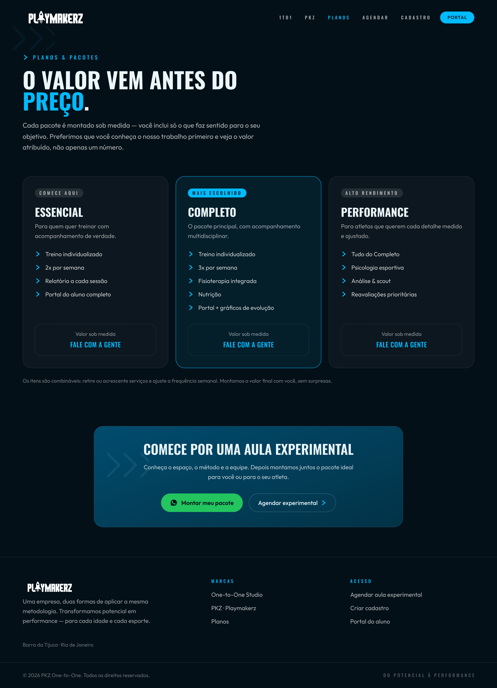
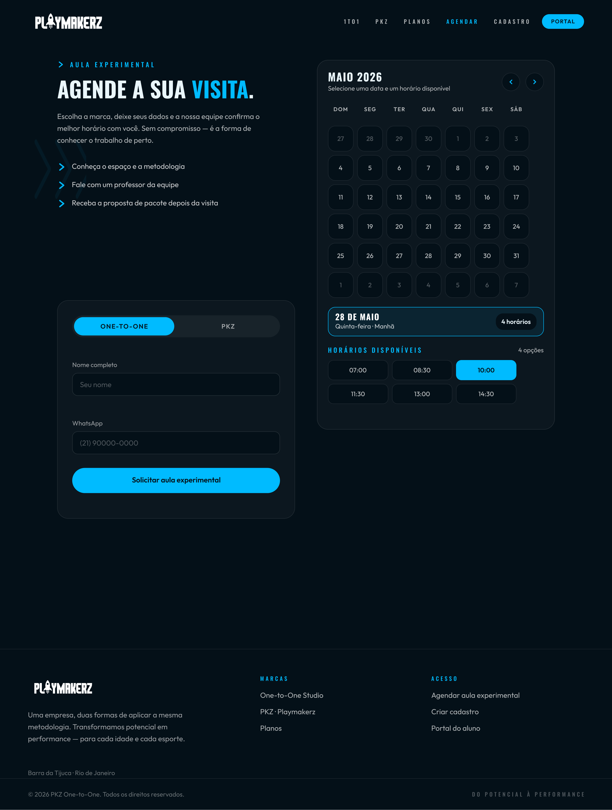
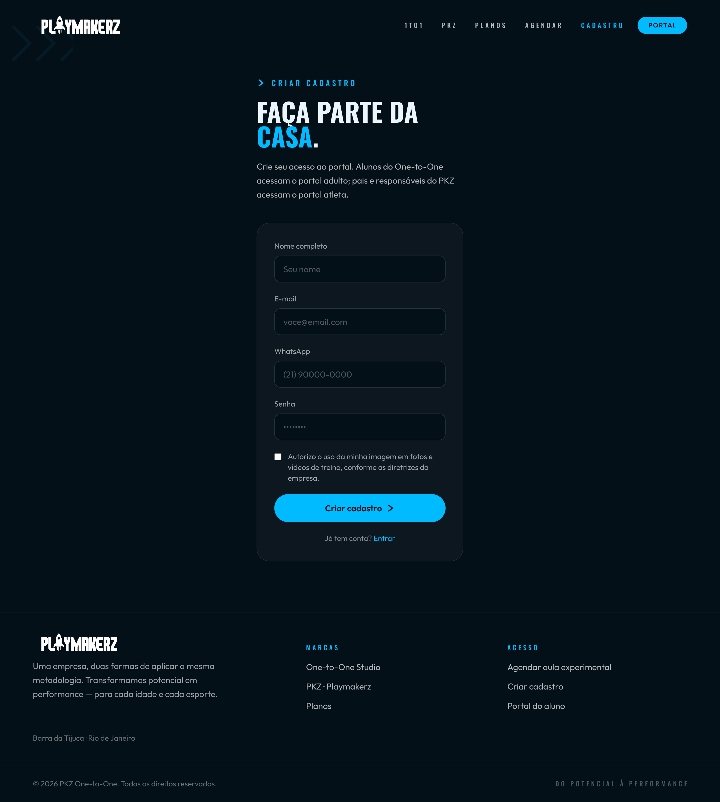

# PFE-2026-2-AP1-Grupo5-terca

# PKZ & One to One — Plataforma Web

Projeto do Grupo 5 da disciplina de Projeto Front-End.

Site institucional para apresentação e divulgação dos serviços PKZ, voltado para atletas de alto rendimento, e One to One, voltado para treinamento individualizado e qualidade de vida. O objetivo é fortalecer a marca, centralizar o funil de captação de leads e dar a cada público uma jornada de navegação clara.

## 🎯 Problema

Hoje a empresa depende de canais informais (redes sociais e mensagens diretas), o que causa:

- **Falta de autoridade** — sem domínio próprio, a marca perde credibilidade com patrocinadores, atletas e clientes corporativos;
- **Perda de leads** — não existe um funil de conversão centralizado;
- **Conflito de personas** — atletas buscam performance e dados; clientes de fitness buscam saúde, flexibilidade e acolhimento;
- **Jornadas desarticuladas** — o visitante não identifica rapidamente qual serviço atende às suas necessidades.

## 💡 Solução

Um site com rotas separadas para cada público, identidade visual própria para cada serviço e um fluxo simples de agendamento de aula experimental.

| Página              | Descrição                                                                                  |
| ------------------- | ------------------------------------------------------------------------------------------ |
| **Landing page**    | Apresentação geral da marca, com divisão visual entre PKZ e One to One                     |
| **Home PKZ**        | Metodologia científica, corpo técnico, infraestrutura, curva de evolução e FAQ             |
| **Home One to One** | Qualidade de vida, treinadores, depoimentos e FAQ                                          |
| **Planos**          | Pacotes Essencial, Completo (mais escolhido) e Performance, com CTA para aula experimental |
| **Agendamento**     | Formulário com seleção da marca, nome, WhatsApp e melhor período                           |
| **Cadastro**        | Criação de conta unificada, com aceite de uso de imagem                                    |
| **Portal**          | Login segmentado em Portal Aluno (adulto) e Portal Atleta                                  |
| **Contato**         | Telefone, e-mail e redes sociais                                                           |

## 🖼️ Protótipo

Protótipo completo no Figma: [Protótipo PKZ / One to One](https://www.figma.com/design/pnShzjmEQY8olJnvl5Vf3R/Prot%C3%B3tipo-PKZ-One-to-One?node-id=0-1&t=1Yf0yie3bvgGDxpP-1)

<details>
<summary>Ver telas</summary>

| Landing page                                                  | PKZ                               | One to One                                          |
| ------------------------------------------------------------- | --------------------------------- | --------------------------------------------------- |
| .png>) |  |  |

| Planos                                  | Agendamento                                       | Cadastro                                    |
| --------------------------------------- | ------------------------------------------------- | ------------------------------------------- |
|  |  |  |

| Portal – Aluno                                            | Portal – Atleta                                             |
| --------------------------------------------------------- | ----------------------------------------------------------- |
|  |  |

</details>

## 🗓️ Gestão do projeto (Scrum)

O projeto é organizado em Sprints semanais. A documentação completa, com Product Backlog, objetivo, Sprint Backlog, incremento, review e retrospectiva de cada Sprint, está em [Scrum/Sprints-Scrum.md](Scrum/Sprints-Scrum.md).

| Sprint            | Período         | Foco                                                             |
| ----------------- | --------------- | ---------------------------------------------------------------- |
| **1**             | 01 a 07/09      | Kickoff e mapa mental                                            |
| **2**             | 08 a 14/09      | Planejamento (5W2H, AHT, Documento de Visão, Brainstorm)         |
| **3**             | 15 a 21/09      | Refinamento dos artefatos                                        |
| **4**             | 22 a 28/09      | Consolidação, protótipo no Figma, README e registro das reuniões |
| **5** _(próxima)_ | 29/09 em diante | Início da codificação em HTML/CSS                                |

## 📂 Estrutura do repositório

```
├── 5w2h/          # Planejamento 5W2H do projeto
├── AHT/           # Árvore hierárquica de tarefas (PlantUML + imagem)
├── Brainstorm/    # Definição do problema, geração de ideias e proposta final
├── Doc_visao/     # Documento de visão
├── Mindmap/       # Mapa mental do projeto
├── Prototipo/     # Link do Figma e telas exportadas (páginas e portais)
├── Scrum/         # Documentação das Sprints
├── Transcrições e Resumo/  # Transcrições das reuniões com o cliente e guia do site
└── README.md
```
